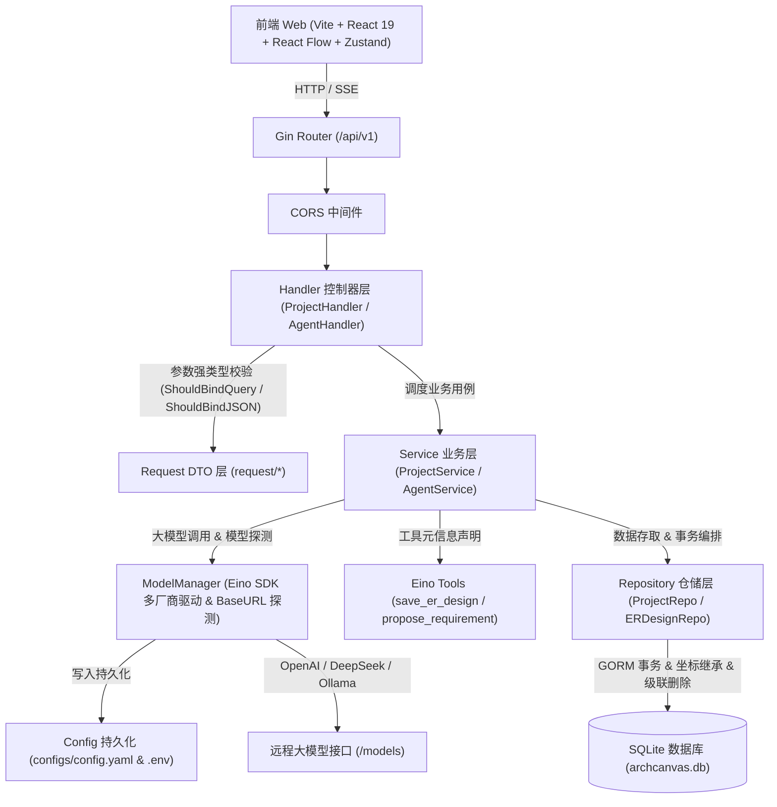

# ArchCanvas (架构画板)

<p align="center">
  <strong>🎨 AI 驱动的暖纸感架构设计画板 · 让数据库建模如在草稿纸上绘制般自然</strong>
</p>

<p align="center">
  <em>An AI-Powered Visual Database Architecture & ER Design Studio with Warm Papercraft Neo-Brutalism Aesthetics.</em>
</p>

<p align="center">
  
  
  
  
  
  
</p>

---

## 🌟 核心理念与亮点

**ArchCanvas** 是一款面向现代化软件工程师与架构师的数据架构可视化设计工作台。

告别千篇一律、令人审美疲劳的“AI 紫”与玻璃拟态，ArchCanvas 采用**暖色纸感新野兽派（Warm Papercraft & Neo-Brutalist Studio）**设计美学，提供如建筑设计草图般利落、沉稳的专业交互质感；同时将大模型能力通过**白盒两阶段流水线**深度融入建模全过程，让业务概念到物理数据库建表的推导演变清晰受控。

```
┌────────────────────────────────────────────────────────────────────────┐
│                        ArchCanvas Studio 画板                          │
│                                                                        │
│   [ 实体节点表 ]             [ 关系连线 ]             [ 实体节点表 ]    │
│   ┌──────────────┐         1             N         ┌──────────────┐    │
│   │ users        │────────────────────────────────>│ orders       │    │
│   ├──────────────┤                                 ├──────────────┤    │
│   │ 🔑 id: BIGINT│                                 │ 🔑 id: BIGINT│    │
│   │    name: STR │                                 │ 🔗 user_id   │    │
│   └──────────────┘                                 └──────────────┘    │
│                                                                        │
│   [ 底部 AI 架构指令坞 ]                                               │
│   ┌────────────────────────────────────────────────────────────────┐   │
│   │ "帮我增加积分商城模块，包含商品兑换记录与防刷锁..."           [↑] │   │
│   └────────────────────────────────────────────────────────────────┘   │
└────────────────────────────────────────────────────────────────────────┘
```

---

## ✨ 核心特性

### 1. 🧠 白盒两阶段 AI 架构推导引擎（Two-Stage Agent）
- **阶段一：纯业务概念分析（`propose_requirement`）**
  - AI 作为“资深需求分析师”，从自然语言中剥离领域实体、属性意图与操作类型（创建/修改/保留/删除）；
  - **零落库副作用**，实时打字机推送思考链（Thinking tokens）；
- **门禁拦截（Decision Gate）**：
  - 若需求存在模糊或冲突，开发者代码层直接拦截并弹出**渐进式追问选项卡**，彻底规避 AI 幻觉和误写入；
- **阶段二：物理建表与类型建模（`save_er_design`）**：
  - 架构师角色推导物理 SQL 类型（`BIGINT`, `VARCHAR(128)`, `DATETIME`）、代码映射类型（`uint64`, `string`）、主键与外键关联；
  - 推导完成后自动委托领域服务进行原子持久化，画板自动排版刷新。

### 2. ⚡ SQL DDL 逆向工程解析（Reverse Engineering）
- **多方言兼容**：支持 MySQL、PostgreSQL（`SERIAL` / `BIGSERIAL` / 行内 `REFERENCES`）、SQLite 的标准 `CREATE TABLE` 脚本；
- **双重关系识别**：
  - 显式外键：提取 `FOREIGN KEY (...) REFERENCES ...(...)` 生成物理连线；
  - 逻辑外键推导：结合大厂禁止物理外键的规范，自动识别 `xxx_id` 命名（如 `orders.user_id` 关联 `users` 表）并自动织网连线；
- **排版自动化**：解析后无缝调用 Dagre 算法完成层次化排版（LR 流向），一键导入立即可用。

### 3. 📐 暖纸感专业交互画板（Warm Papercraft Studio）
- **视觉风格**：1.5px 坚挺黑线、暖米纸色底（`#faf7f0`）、陶土红标记色（`#df4e3e`）与实体硬投影；
- **坐标记忆与继承**：节点具有物理坐标感知，保存或 AI 重绘时自动继承历史坐标，拒绝节点重叠归零；
- **多功能检查器（Inspector）**：右侧抽屉实时查看实体属性、快捷修改字段属性与即时预览标准 MySQL DDL；
- **垂直悬浮工具盘**：集成选择/抓手切换、视图重置、缩放百分比监控。

### 4. ⏪ 完整画板撤销 / 重做系统（Undo / Redo）
- **双栈历史引擎**：内置 50 步容量的 `past` / `future` 历史栈，覆盖实体增删、属性修改、关系连线、节点拖拽、自动布局、SQL 导入与 AI 推导上屏；
- **600ms 智能文本防抖折叠**：在编辑表名与字段名时，连续输入在 600ms 内自动归并为一个历史快照，拒绝单字按键刷爆历史栈；
- **原生输入保护**：焦点处于输入框或文本域内部时自动放行，优先执行输入框内部的原生文本撤销；
- **状态联动与服务端落库**：撤销后智能清理失效选区，并自动触发防抖调度同步落库至后端 SQLite。

### 5. 🔌 CC-Switch 风格多模型热插拔（Model Hot-Switching）
- **通用 Provider 接入**：基于字节跳动 `cloudwego/eino` 框架，完美兼容 DeepSeek、OpenAI、Qwen、Ollama 等任何 OpenAI 兼容端点；
- **端点动态探测**：输入 `BaseURL` 即可实时拉取远程可用模型清单，自带关键词即时过滤的定制原生下拉菜单；
- **配置双向写回**：前端切换模型后，后端自动安全写回 `config.yaml` 与 `.env`，即刻热生效无需重启服务。

### 6. 🛡️ 工业级后端设计与事务级联删除
- **纯语义化 API 契约**：全站仅使用语义化 `GET` 与 `POST` 动作，入参全部通过强类型结构体（DTO）绑定校验；
- **9 步事务级联删除**：删除项目时通过数据库事务按拓扑倒序清理关联数据（属性 ➔ 实体 ➔ 关系 ➔ 消息 ➔ 对话 ➔ AI 上下文 ➔ 项目），保证零孤儿数据残留。

---

## 🏗️ 系统架构设计



---

## 📁 目录结构一览

```text
archcanvas/
├── server/                      # Go 后端工程
│   ├── cmd/server/main.go       # 系统主入口，依赖容器组装
│   ├── configs/                 # 配置文件目录
│   │   ├── config.yaml          # 全局服务与大模型配置
│   │   └── .env                 # 环境变量与 API Key（支持热写回）
│   ├── internal/
│   │   ├── agent/               # 大模型驱动 (Eino SDK)、多模型缓存与探测管理
│   │   ├── config/              # 配置加载、.env 更新与 YAML 双向写回
│   │   ├── database/            # SQLite 连接初始化与全自动表结构迁移
│   │   ├── domain/              # 纯领域实体 (ERDesign, BusinessConcept) 与业务枚举
│   │   ├── handler/             # Gin HTTP 控制器 (参数绑定、SSE 响应)
│   │   ├── middleware/          # CORS 跨域控制
│   │   ├── model/               # GORM 物理数据模型映射
│   │   ├── repository/          # SQLite 数据仓储实现 (事务级联删除、坐标继承)
│   │   ├── router/              # 语义化 API 路由注册 (/api/v1)
│   │   └── service/             # 核心服务 (ProjectService, AgentService 两阶段编排)
│   ├── pkg/response/            # 统一 API 响应格式封装
│   ├── request/                 # 强类型请求入参 DTO 定义
│   └── go.mod                   # Go 依赖清单
│
└── web/                         # 前端 React SPA 工程
    ├── src/
    │   ├── api/client.ts        # 统一 HTTP / SSE 接口客户端
    │   ├── components/          # 核心 UI 组件
    │   │   ├── AiPanel.tsx      # 底部 AI 架构指令坞
    │   │   ├── Canvas.tsx       # 全尺寸架构画板与空画布引导
    │   │   ├── ClarificationDeck.tsx # 需求歧义渐进式澄清卡片组
    │   │   ├── DataDialog.tsx   # 导入导出弹窗 (SQL DDL 逆向 / JSON / Mermaid)
    │   │   ├── Inspector.tsx    # 右侧属性检查器与 DDL 即时预览
    │   │   ├── ModelSelector.tsx# 暖纸感模型即时探测下拉选择器
    │   │   ├── ProjectMenu.tsx  # 项目管理菜单 (新建/切换/重命名/删除)
    │   │   ├── Select.tsx       # 纯手工定制新野兽派下拉组件
    │   │   ├── TableNode.tsx    # 自定义 React Flow 数据库表节点
    │   │   ├── RelationEdge.tsx # 自定义 React Flow 关系连线
    │   │   └── Toolbar.tsx      # 顶部控制栏
    │   ├── export/              # SQL DDL 导出/逆向解析器、Mermaid 转换器
    │   ├── flow/                # React Flow 适配器与 Dagre 自动排版算法
    │   ├── store/erStore.ts     # Zustand 全局领域状态管理与防抖自动保存
    │   └── types/dsl.ts         # 前端 ER DSL 类型定义 (后端 Domain 镜像)
    ├── package.json             # 前端依赖配置
    └── vite.config.ts           # Vite 构建配置
```

---

## 🚀 快速开始

### 1. 环境准备
- **Go**：`>= 1.22`
- **Node.js**：`>= 18`
- **系统支持**：macOS / Linux / Windows

### 2. 启动后端服务
```bash
# 1. 进入后端目录
cd server

# 2. 检查或配置大模型（可在 configs/config.yaml 中配置，或启动后在前端界面配置）
# 3. 运行后端服务（默认监听 127.0.0.1:8080，使用本地 SQLite）
go run ./cmd/server
```

### 3. 启动前端界面
```bash
# 1. 打开新终端，进入前端目录
cd web

# 2. 安装依赖
npm install

# 3. 启动本地开发服务
npm run dev
```

启动成功后，使用浏览器访问：**`http://localhost:5173`** 即可进入 ArchCanvas 架构画板。

---

## ⌨️ 画板全局快捷键

| 操作 | macOS 快捷键 | Windows / Linux 快捷键 | 说明 |
| :--- | :--- | :--- | :--- |
| **撤销 (Undo)** | `⌘ + Z` | `Ctrl + Z` | 回退画板上一步操作（支持节点拖拽、连线、实体/属性变更、自动布局等） |
| **重做 (Redo)** | `⇧ + ⌘ + Z` | `Ctrl + Shift + Z` / `Ctrl + Y` | 恢复已撤销的画板设计操作 |
| **手动落库保存** | `⌘ + S` | `Ctrl + S` | 立即触发后端 SQLite 持久化保存（平日也会自动防抖保存） |
| **删除选区** | `Backspace` / `Delete` | `Backspace` / `Delete` | 快捷删除当前选中的实体表或关系连线 |
| **输入保护** | - | - | 当光标位于文本输入框内时，自动放行原生文字编辑撤销 |

---

## 📡 API 接口速查（纯语义化风格）

后端采用 Action-based 语义化风格，所有接口仅使用 `GET` 与 `POST`：

| HTTP 方法 | 接口路径 | 功能说明 | 入参类型 |
| :--- | :--- | :--- | :--- |
| `GET` | `/api/v1/projects/list` | 获取所有项目列表 | 无 |
| `POST` | `/api/v1/projects/create` | 创建新项目 | JSON Body (`name`, `description`) |
| `POST` | `/api/v1/projects/delete` | 事务级联删除项目 | JSON Body (`project_id`) |
| `POST` | `/api/v1/projects/update` | 更新项目名称或描述 | JSON Body (`project_id`, `name`, `description`) |
| `GET` | `/api/v1/projects/detail` | 获取项目元信息与设计图 | Query (`?id=xxx`) |
| `GET` | `/api/v1/projects/get-er-design` | 拉取项目完整 ER 设计 | Query (`?id=xxx`) |
| `POST` | `/api/v1/projects/save-er-design` | 保存画板设计（带坐标记忆） | JSON Body (`project_id`, `entities`, `relations`) |
| `GET` | `/api/v1/models/list` | 获取/动态探测可用模型列表 | Query (`?base_url=...&api_key=...&provider=...`) |
| `POST` | `/api/v1/models/save` | 保存并热切换模型配置 | JSON Body (`provider, model, base_url, api_key, set_as_default`) |
| `POST` | `/api/v1/agent/chat` | AI 两阶段架构推导（SSE 流式） | JSON Body (`project_id, input, model_provider, model_name`) |

---

## 🛠️ 技术栈选型

- **前端技术栈**：
  - **核心框架**：React 19, TypeScript
  - **构建工具**：Vite 8
  - **画板引擎**：`@xyflow/react` (React Flow 12) + `dagre` (有向无环图自动层次布局)
  - **样式体系**：Tailwind CSS v4
  - **状态管理**：Zustand 5 (纯内存领域模型驱动 + 防抖调度落库)
  - **运行时校验**：Zod 4 (前端 ER DSL 镜像校验)
- **后端技术栈**：
  - **开发语言**：Go 1.22+
  - **Web 框架**：Gin (`github.com/gin-gonic/gin`)
  - **ORM 框架**：GORM (`gorm.io/gorm`, `gorm.io/driver/sqlite`)
  - **AI Agent 框架**：CloudWeGo Eino SDK (`github.com/cloudwego/eino`)
  - **配置中心**：Viper + Go-YAML (`github.com/goccy/go-yaml`)
  - **数据存储**：SQLite (开箱即用无外置服务依赖)

---

## 📄 开源许可证

本项目基于 [MIT License](LICENSE) 开源协议。
