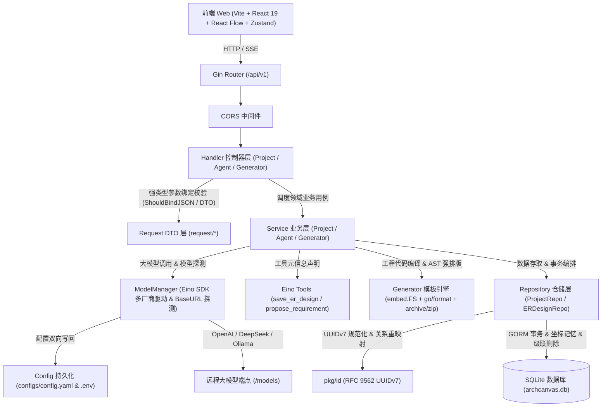

# ArchCanvas (架构画板)

<p align="center">
  <strong>🎨 AI 驱动的暖纸感架构设计画板 · 让数据库建模如在草稿纸上绘制般自然</strong>
</p>

<p align="center">
  <em>An AI-Powered Visual Database Architecture & ER Design Studio with Warm Papercraft Neo-Brutalism Aesthetics.</em>
</p>

<p align="center">
  
  
  
  
  
  
</p>

---

## 🌟 核心理念与亮点

**ArchCanvas** 是一款面向现代化软件工程师与架构师的数据架构可视化设计工作台。

告别千篇一律、令人审美疲劳的“AI 紫”与玻璃拟态，ArchCanvas 采用**暖色纸感新野兽派（Warm Papercraft & Neo-Brutalist Studio）**设计美学，提供如建筑设计草图般利落、沉稳的专业交互质感；同时将大模型能力通过**白盒两阶段流水线**深度融入建模全过程，让业务概念到物理数据库建表的推导演变清晰受控。

系统独创**标准陈氏概念模型（Chen's ER）⇄ 物理数据表模型（Relational Table）**双视图自由切换体系，并在两阶段之间架起严谨、教科书级的理论桥梁：

```
┌────────────────────────────────────────────────────────────────────────┐
│                        ArchCanvas Studio 画板                          │
│                                                                        │
│   [ 概念视图 · 标准陈氏 ER 模型 ]                                      │
│     (用户名)   (邮箱)                                                  │
│        \       /                                                       │
│       ┌─────────┐              ◇ 发布              ┌─────────┐         │
│       │  用户   │────── 1 ───────[1:N]─────── N ───│  文章   │         │
│       │  users  │                                  │articles │         │
│       └─────────┘                                  └────┬────┘         │
│            | (<u>编号</u>)                                    /     \        │
│                                                         (<u>编号</u>) (标题)   │
│   [ 物理视图 · 关系数据库表 ]                                          │
│   ┌──────────────┐         1             N         ┌──────────────┐    │
│   │ users        │────────────────────────────────>│ articles     │    │
│   ├──────────────┤                                 ├──────────────┤    │
│   │ 🔑 id: BIGINT│                                 │ 🔑 id: BIGINT│    │
│   │    name: STR │                                 │ 🔗 author_id │    │
│   └──────────────┘                                 └──────────────┘    │
│                                                                        │
│   [ 顶部切换 ]:  ◩◇⬭ 概念(陈氏)   ⇄   ⊞ 物理(数据表)   ⇄   ‹› DSL 源码 │
│   [ 架构指令坞 ]: "增加文章与标签的多对多打标签联系，以及带审核的评论..."[↑]│
└────────────────────────────────────────────────────────────────────────┘
```

---

## ✨ 核心特性

### 1. 🔀 标准陈氏概念图 ⇄ 物理数据表双视图架构（Dual-View Architecture）
- **标准陈氏 ER 概念模型（Peter Chen 1976 规范）**：
  - **实体（矩形）**：纯正双语呈现，第一行加粗展示核心中文业务概念（如 `用户`、`文章`、`媒体`），第二行等宽小字展示物理表名（如 `users`、`articles`、`media`）；
  - **联系（菱形）**：立体投影菱形节点，内置业务动词（如 `发布`、`归属分类`、`打标签`、`包含评论`、`包含媒体`）及统一中性基数胶囊（`1:1`、`1:N`、`M:N`）；
  - **属性（椭圆）**：精炼纯粹的 2~4 字业务名词（自动过滤“唯一”、“非空”、“用于校验”等技术注释长句），主键严格按教科书规范带有经典下划线（<ins>编号</ins>），鼠标悬浮即可查看完整数据类型与原始注释；
  - **多对多中间表自动升华**：概念视图自动识别纯技术联结表（Junction Table，如 `article_tags`），**隐藏孤立物理表并升华为连接两端核心实体的 `M:N` 菱形联系节点**，彻底消解“中间表为什么没关系”、“表是不是重复了”的困扰；
  - **外键冗余智能剔除**：陈氏概念模型中外键已由菱形连线完整承载，属性椭圆中自动过滤 `user_id` / `category_id` 等技术外键；
  - **拓扑感知 2D 紧凑聚类排版引擎（Topology-Aware 2D Clustered Layout）**：彻底告别传统一维长流水线式的 Dagre 单向拉伸！自动计算图拓扑连接度（Degree），将中枢实体（如度数最高的 `用户` 表）置顶居中，自动将关联子图聚类为二维紧凑矩阵（左侧归集组织架构簇，右侧归集权限控制簇）；画布横向跨度从 2600px+ 大幅压缩至 1050px 左右，长宽比精准控制在 16:9 / 4:3 黄金视口（~1.8 : 1），全屏 100% 原始缩放即可尽览全图；
  - **动态就近几何锚点（Nearest Cardinal Handles）**：实体与菱形具备完整的上下左右四向对称锚点，根据节点实时相对中心向量 $(\Delta x, \Delta y)$ 动态选取距离最近的最优出入端口（垂直走上下、水平走左右、斜向对角平滑穿行），彻底杜绝横穿全图与 S 型回折绕圈；
  - **关系菱形几何中点自适应插值**：菱形节点不再硬占 DAG 排序层级，而是自适应定位在所连两实体连线的几何中心点，多关系自动法向微移防重叠；
  - **属性椭圆外侧空闲面自适应吸附（避障排布）**：算法自动侦测实体各个朝向的连线占用，属性优先吸附在实体外侧（无连线侧，如用户属性全部规整在正上方，部门属性排在正下方），实现属性与关系连线的物理隔离，彻底根绝重叠交叉。
- **物理数据表模型（Relational Table View）**：
  - 展示真实数据库物理表卡片，呈现精确字段级 SQL 类型（`BIGINT`、`VARCHAR(64)`）、主外键（PK/UQ/FK）标记与字段级贝塞尔连线；
- **DSL 源码审查（Source DSL View）**：
  - 呈现底层的 JSON 领域模型规范源码，支持一键复制代码。

### 2. 🧠 白盒两阶段 AI 架构推导引擎（Two-Stage Agent）
- **阶段一：纯业务概念分析（`propose_requirement`）**：
  - AI 作为“资深需求分析师”，从自然语言中剥离领域实体、属性意图与操作类型（创建/修改/保留/删除）；
  - **零落库副作用**，实时打字机推送思考链（Thinking tokens）；
- **门禁拦截（Decision Gate）**：
  - 若需求存在模糊或冲突，开发者代码层直接拦截并弹出**渐进式追问选项卡**，彻底规避 AI 幻觉和误写入；
- **阶段二：物理建表与类型建模（`save_er_design`）**：
  - 架构师角色推导物理 SQL 类型（`BIGINT`, `VARCHAR(128)`, `DATETIME`）、代码映射类型（`uint64`, `string`）、主键与外键关联；
  - 推导完成后自动委托领域服务进行原子持久化，画板自动排版刷新；
- **自环关系智能净化**：
  - 自动过滤 `source == target` 的自引用关系连线（如 `parent_id` 树形结构），保留表中外键字段的同时避免生成遮挡画布的表内回环；
- **空白画板智能自愈排版**：
  - 首次从空画板通过自然语言对话生成实体时，系统自动识别并执行初次居中自动整理，无需用户手动拖拽调整。

### 3. ⚡ SQL DDL 逆向工程解析与双向保真（Reverse Engineering）
- **多方言兼容**：支持 MySQL、PostgreSQL（`SERIAL` / `BIGSERIAL` / 行内 `REFERENCES`）、SQLite 的标准 `CREATE TABLE` 脚本；
- **双重关系识别**：
  - 显式外键：提取 `FOREIGN KEY (...) REFERENCES ...(...)` 生成物理连线；
  - 逻辑外键推导：结合大厂禁止物理外键的规范，自动识别 `xxx_id` 命名（如 `orders.user_id` 关联 `users` 表）并自动织网连线；
- **排版自动化与注释全保真**：解析后无缝调用层次化算法完成拓扑排版，且在 SQL 导入与导出双向往返中完整保留表与字段的所有单行、行末及块级中文注释。

### 4. 🖼️ 高清矢量设计图导出与剪贴板一键复制（HD Export & Instant Clipboard）
- **多格式高清导出**：一键导出高分辨率 PNG 图片与无损矢量 SVG 架构图，完美保留暖纸新野兽派质感底色与抗锯齿细节；
- **系统剪贴板一键复制（Copy to Clipboard）**：无需在本地生成与管理临时图片文件，一键即可将架构图以二进制 PNG 流写入系统剪贴板，支持在飞书、钉钉、企业微信、语雀、Notion 或 Markdown 文档中直接 `⌘+V` / `Ctrl+V` 粘贴上屏，架构设计评审与技术文档沉淀极度流畅；
- **多方言 SQL 与 Mermaid 语法双向导出**：不仅支持图形导出，还支持导出标准 MySQL / PostgreSQL / SQLite DDL 语句及 Mermaid ER 图语法代码。

### 5. ⏪ 模块化 Slices 状态架构与 RFC 6902 增量差异补丁历史引擎（Undo / Redo）
- **Zustand 模块化 Slices 架构**：将庞大的前端画板状态正交解耦为清晰的领域切片（`erDesignSlice` 物理表、`conceptualSlice` 概念图、`historySlice` 历史栈、`projectSlice` 项目管理、`aiChatSlice` 对话流、`uiSlice` 交互），彻底告别单文件巨石状态；
- **RFC 6902 JSON Patch 增量历史引擎**：由深拷贝全量快照全面升级为极简增量差异补丁（Forward Patches）与逆向回滚补丁（Inverse Patches），历史栈内存开销直降 90%+，高频拖拽微调仅记录微量坐标差异；
- **600ms 智能文本防抖折叠**：在编辑表名与字段名时，连续输入在 600ms 内自动归并为一个历史快照，拒绝单字按键刷爆历史栈；
- **双视图撤销一致性**：无论是概念模型的实体/联系操作，还是物理表及字段级的增删改查，撤销与重做均实现精准联动与对称回滚；
- **原生输入保护与服务端落库**：焦点处于输入框或文本域内部时自动放行原生撤销；撤销后自动清理失效选区，并通过防抖调度原子落库至后端 SQLite。

### 6. 📐 暖纸感专业交互画板（Warm Papercraft Studio）
- **视觉风格**：1.5px 坚挺黑线、暖米纸色底（`#faf7f0`）、陶土红标记色（`#df4e3e`）与实体硬投影；
- **坐标记忆与继承**：节点具有物理坐标感知，保存或 AI 重绘时自动继承历史坐标，拒绝节点重叠归零；
- **多功能检查器（Inspector）**：右侧抽屉实时查看实体属性、快捷修改字段属性与即时预览标准 MySQL DDL；
- **垂直悬浮工具盘**：集成选择/抓手切换、视图重置、自动整理、缩放百分比监控。

### 7. 🔌 CC-Switch 风格多模型热插拔（Model Hot-Switching）
- **通用 Provider 接入**：基于字节跳动 `cloudwego/eino` 框架，完美兼容 DeepSeek、OpenAI、Qwen、Ollama 等任何 OpenAI 兼容端点；
- **端点动态探测**：输入 `BaseURL` 即可实时拉取远程可用模型清单，自带关键词即时过滤的定制原生下拉菜单；
- **配置双向写回**：前端切换模型后，后端自动安全写回 `config.yaml` 与 `.env`，即刻热生效无需重启服务。

### 8. 🛡️ 工业级后端设计与事务级联删除
- **纯语义化 API 契约**：全站仅使用语义化 `GET` 与 `POST` 动作，入参全部通过强类型结构体（DTO）绑定校验；
- **9 步事务级联删除**：删除项目时通过数据库事务按拓扑倒序清理关联数据（属性 ➔ 实体 ➔ 关系 ➔ 消息 ➔ 对话 ➔ AI 上下文 ➔ 项目），保证零孤儿数据残留。

### 9. 📦 企业级 Go 工程脚手架一键生成（Production-Grade Scaffold Generator）
- **Standard Go Layout 大厂规范分层**：基于画布设计的表结构与关联，秒级编译导出独立、开箱即跑的完整 Go Web 后端工程（包含 `cmd/server`、`configs`、`internal/model`、`internal/repository`、`internal/service`、`internal/handler`、`internal/router`、`pkg/response` 等）；
- **GORM 关联自动推导与显式 DI**：自动识别 1:1、1:N 及 M:N 拓扑关系，精准推导生成 `HasMany`、`BelongsTo` 以及带 `gorm:"many2many:xxx;"` 声明的多对多关联，并在 `main.go` 中完成零全局变量、显式构造器装配的依赖注入链（`NewRepo` ➔ `NewService` ➔ `NewHandler`）；
- **Go 标准库 AST 强力排版校验（`go/format.Source`）**：所有渲染出的 Go 源码统一通过官方 AST 语法解析器排版并校验，确保生成的代码零语法瑕疵；
- **纯内存流式 ZIP 导出（`archive/zip`）**：模板渲染与压缩全程在内存流中完成，零服务器临时磁盘文件落地，并发安全无残留；
- **暖纸质感代码工作室（Warm Papercraft Code Studio）**：去 AI 廉价感、无生硬黑框，提供按层级折叠的分组目录树、文件名即时过滤、粘性固定行号与印刷质感墨水语法高亮。

### 10. 🆔 全局主键升级为 RFC 9562 UUIDv7（Time-Sorted Monotonic IDs）
- **时序单调与 B+ 树友好**：全面采用最新的 RFC 9562 标准 UUIDv7，高 48 位嵌入毫秒级时间戳，解决传统随机 UUIDv4 引起的索引页频繁分裂，具备自增 ID 级别追加写入性能；
- **跨项目防冲突与入库自愈**：彻底摒弃易导致主键冲突的英文名 ID；后端入库层（`SaveByProjectID`）具备智能重映射与关联自愈机制，自动识别非法或临时占位符，完成外键关系自动重定向。

---

## 🏗️ 系统架构设计


```mermaid
flowchart TD
    Client["前端 Web (Vite + React 19 + React Flow + Zustand)"] -->|"HTTP / SSE"| Router["Gin Router (/api/v1)"]
    Router --> Middleware["CORS 中间件"]
    Middleware --> Handler["Handler 控制器层 (Project / Agent / Generator)"]
    
    Handler -->|"强类型参数绑定校验 (ShouldBindJSON / DTO)"| DTO["Request DTO 层 (request/*)"]
    Handler -->|"调度领域业务用例"| Service["Service 业务层 (Project / Agent / Generator)"]
    
    Service -->|"大模型调用 & 模型探测"| AgentMgr["ModelManager (Eino SDK 多厂商驱动 & BaseURL 探测)"]
    AgentMgr -->|"配置双向写回"| Config["Config 持久化 (configs/config.yaml & .env)"]
    AgentMgr -->|"OpenAI / DeepSeek / Ollama"| LLM["远程大模型端点 (/models)"]
    Service -->|"工具元信息声明"| Tools["Eino Tools (save_er_design / propose_requirement)"]
    
    Service -->|"工程代码编译 & AST 强排版"| GenEng["Generator 模板引擎 (embed.FS + go/format + archive/zip)"]
    
    Service -->|"数据存取 & 事务编排"| Repo["Repository 仓储层 (ProjectRepo / ERDesignRepo)"]
    Repo -->|"UUIDv7 规范化 & 关系重映射"| IDPkg["pkg/id (RFC 9562 UUIDv7)"]
    Repo -->|"GORM 事务 & 坐标记忆 & 级联删除"| SQLite[("SQLite 数据库 (archcanvas.db)")]
```

---

## 📁 目录结构一览

```text
archcanvas/
├── server/                      # Go 后端工程
│   ├── cmd/server/main.go       # 系统主入口，显式依赖容器组装
│   ├── configs/                 # 配置文件目录
│   │   ├── config.yaml          # 全局服务与大模型配置
│   │   └── .env                 # 环境变量与 API Key（支持热写回）
│   ├── internal/
│   │   ├── agent/               # 大模型驱动 (Eino SDK)、多模型缓存与探测管理
│   │   ├── config/              # 配置加载、.env 更新与 YAML 双向写回
│   │   ├── database/            # SQLite 连接初始化与全自动表结构迁移
│   │   ├── domain/              # 纯领域实体 (ERDesign, BusinessConcept) 与业务枚举
│   │   ├── generator/           # Go 工程脚手架生成引擎 (13 类模板、AST 格式化、流式打包)
│   │   ├── handler/             # Gin HTTP 控制器 (参数绑定、SSE 响应、ZIP 流式下发)
│   │   ├── middleware/          # CORS 跨域控制
│   │   ├── model/               # GORM 物理数据模型映射
│   │   ├── repository/          # 数据仓储实现 (事务级联删除、坐标记忆、UUIDv7 自动重映射)
│   │   ├── router/              # 语义化 API 路由注册 (/api/v1)
│   │   └── service/             # 核心服务 (ProjectService, AgentService 两阶段编排)
│   ├── pkg/
│   │   ├── id/                  # RFC 9562 UUIDv7 有序唯一标识生成与校验
│   │   └── response/            # 统一 API 响应格式封装
│   ├── request/                 # 强类型请求入参 DTO 定义
│   └── go.mod                   # Go 依赖清单
│
└── web/                         # 前端 React SPA 工程
    ├── src/
    │   ├── api/client.ts        # 统一 HTTP / SSE 接口客户端
    │   ├── components/          # 核心 UI 组件
    │   │   ├── chen/            # 概念视图（陈氏 ER）组件库
    │   │   │   ├── ChenEntityNode.tsx    # 矩形实体节点（中文业务概念 + 英文表名）
    │   │   │   ├── ChenRelationNode.tsx  # 菱形联系节点（业务动词 + 1:1/1:N/M:N 基数）
    │   │   │   ├── ChenAttributeNode.tsx # 椭圆属性节点（纯净名词 + 经典下划线主键）
    │   │   │   └── ChenEdge.tsx          # 带有 1/N/M 徽标与虚线属性连接的智能连线
    │   │   ├── AiPanel.tsx      # 底部/侧栏 AI 架构指令坞 (⌘L 快捷收展)
    │   │   ├── Canvas.tsx       # 全尺寸架构画板与双视图切换控制
    │   │   ├── ClarificationDeck.tsx # 需求歧义渐进式澄清卡片组
    │   │   ├── DataDialog.tsx   # 导入导出弹窗 (SQL DDL 逆向 / JSON / Mermaid)
    │   │   ├── Inspector.tsx    # 右侧属性检查器与 DDL 即时预览
    │   │   ├── ModelSelector.tsx# 暖纸感模型即时探测下拉选择器
    │   │   ├── ProjectMenu.tsx  # 项目管理菜单 (新建/切换/重命名/删除)
    │   │   ├── ScaffoldDialog.tsx # 暖纸新野兽派代码树与代码预览工作台
    │   │   ├── Select.tsx       # 纯手工定制新野兽派下拉组件
    │   │   ├── TableNode.tsx    # 物理数据库表卡片节点
    │   │   ├── RelationEdge.tsx # 物理字段级关联连线
    │   │   └── Toolbar.tsx      # 顶部控制栏 (双视图切换、撤销重做、脚手架导出)
    │   ├── export/              # SQL DDL 逆向解析/导出、Mermaid 转换与图片导出
    │   ├── flow/                # React Flow 适配器与排版算法
    │   │   ├── adapter.ts       # 物理关系图数据模型投影转换
    │   │   ├── chenAdapter.ts   # 2D 拓扑感知聚类排版引擎、动态锚点与自引用分流
    │   │   └── layout.ts        # 物理表分层拓扑自排版
    │   ├── store/               # Zustand 全局领域状态管理与历史引擎
    │   │   ├── erStore.ts       # Store 主装配入口与防抖落库调度
    │   │   ├── patch.ts         # RFC 6902 JSON Patch 差异对比与双向应用引擎
    │   │   ├── types.ts         # 领域状态与切片接口声明
    │   │   └── slices/          # 模块化领域切片
    │   │       ├── aiChatSlice.ts      # AI 对话与 SSE 流式状态
    │   │       ├── conceptualSlice.ts  # 概念设计与陈氏图业务模型
    │   │       ├── erDesignSlice.ts    # 物理数据表与关联模型
    │   │       ├── historySlice.ts     # 增量差异 Undo/Redo 历史栈
    │   │       ├── projectSlice.ts     # 项目切换与元信息管理
    │   │       └── uiSlice.ts          # 画布视口与交互状态
    │   ├── types/dsl.ts         # 前端 ER DSL 类型定义 (后端 Domain 镜像)
    │   └── utils/chinese.ts     # 业务概念词典与中文推导引擎
    ├── package.json             # 前端依赖配置
    └── vite.config.ts           # Vite 构建配置
```

---

## 🚀 快速开始

### 1. 环境准备
- **Go**：`>= 1.22`
- **Node.js**：`>= 18`
- **系统支持**：macOS / Linux / Windows

### 2. 启动后端服务
```bash
# 1. 进入后端目录
cd server

# 2. 检查或配置大模型（可在 configs/config.yaml 中配置，或启动后在前端界面配置）
# 3. 运行后端服务（默认监听 127.0.0.1:8080，使用本地 SQLite）
go run ./cmd/server
```

### 3. 启动前端界面
```bash
# 1. 打开新终端，进入前端目录
cd web

# 2. 安装依赖
npm install

# 3. 启动本地开发服务
npm run dev
```

启动成功后，使用浏览器访问：**`http://localhost:5173`** 即可进入 ArchCanvas 架构画板。

---

## ⌨️ 画板全局快捷键

| 操作 | macOS 快捷键 | Windows / Linux 快捷键 | 说明 |
| :--- | :--- | :--- | :--- |
| **概念/物理视图切换** | 顶栏按钮切换 | 顶栏按钮切换 | `概念 (陈氏)` ⇄ `物理 (数据表)` ⇄ `DSL 源码` 平滑切换 |
| **展开/折叠 AI 侧栏** | `⌘ + L` | `Ctrl + L` | 快速唤出或收起 AI 架构师指令坞与对话记录 |
| **撤销 (Undo)** | `⌘ + Z` | `Ctrl + Z` | 回退画板上一步操作（支持节点拖拽、连线、实体/属性变更、自动布局等） |
| **重做 (Redo)** | `⇧ + ⌘ + Z` | `Ctrl + Shift + Z` / `Ctrl + Y` | 恢复已撤销的画板设计操作 |
| **手动落库保存** | `⌘ + S` | `Ctrl + S` | 立即触发后端 SQLite 持久化保存（平日也会自动防抖保存） |
| **删除选区** | `Backspace` / `Delete` | `Backspace` / `Delete` | 快捷删除当前选中的实体表或关系连线 |
| **临时平移画布** | `空格 + 拖拽` | `Space + 拖拽` | 随时按住空格键开启抓手快速平移整个画板（Figma 标准交互） |
| **输入保护** | - | - | 当光标位于文本输入框内时，自动放行原生文字编辑撤销 |

---

## 📡 API 接口速查（纯语义化风格）

后端采用 Action-based 语义化风格，所有接口仅使用 `GET` 与 `POST`：

| HTTP 方法 | 接口路径 | 功能说明 | 入参类型 |
| :--- | :--- | :--- | :--- |
| `GET` | `/api/v1/projects/list` | 获取所有项目列表 | 无 |
| `POST` | `/api/v1/projects/create` | 创建新项目（分配 UUIDv7） | JSON Body (`name`, `description`) |
| `POST` | `/api/v1/projects/delete` | 事务级联删除项目 | JSON Body (`project_id`) |
| `POST` | `/api/v1/projects/update` | 更新项目名称或描述 | JSON Body (`project_id`, `name`, `description`) |
| `GET` | `/api/v1/projects/detail` | 获取项目元信息与设计图 | Query (`?id=xxx`) |
| `GET` | `/api/v1/projects/get-er-design` | 拉取项目完整 ER 设计 | Query (`?id=xxx`) |
| `POST` | `/api/v1/projects/save-er-design` | 保存画板设计（UUIDv7 重映射与坐标记忆） | JSON Body (`project_id`, `entities`, `relations`) |
| `GET` | `/api/v1/models/list` | 获取/动态探测可用模型列表 | Query (`?base_url=...&api_key=...&provider=...`) |
| `POST` | `/api/v1/models/save` | 保存并热切换模型配置 | JSON Body (`provider, model, base_url, api_key, set_as_default`) |
| `POST` | `/api/v1/agent/chat` | AI 两阶段架构推导（SSE 流式） | JSON Body (`project_id, input, model_provider, model_name`) |
| `POST` | `/api/v1/generator/preview` | 预览生成的工程代码与文件树 | JSON Body (`project_id, module_name, port, db_driver, ...`) |
| `POST` | `/api/v1/generator/download` | 纯内存流式导出工程 ZIP 压缩包 | JSON Body (`project_id, module_name, port, db_driver, ...`) |

---

## 🛠️ 技术栈选型

- **前端技术栈**：
  - **核心框架**：React 19, TypeScript
  - **构建工具**：Vite 8
  - **画板引擎**：`@xyflow/react` (React Flow 12) + 自研 **2D 拓扑感知聚类排版引擎** + `dagre` (物理表有向分层布局)
  - **样式体系**：Tailwind CSS v4 (暖色纸质感新野兽派排版)
  - **状态管理**：Zustand 5 (模块化 Slices 切片架构 + RFC 6902 JSON Patch 增量差异历史引擎)
  - **图像与剪贴板**：`html-to-image` (高清 PNG / 矢量 SVG 导出与二进制剪贴板写入)
  - **运行时校验**：Zod 4 (前端 ER DSL 镜像校验)
- **后端技术栈**：
  - **开发语言**：Go 1.22+
  - **Web 框架**：Gin (`github.com/gin-gonic/gin`)
  - **ORM 框架**：GORM (`gorm.io/gorm`, `gorm.io/driver/sqlite`)
  - **AI Agent 框架**：CloudWeGo Eino SDK (`github.com/cloudwego/eino`)
  - **代码生成与语法校验**：Go 标准库 `go/format` (AST 强排版)、`embed.FS` (模板内嵌)、`archive/zip` (纯内存流式压缩)
  - **分布式唯一主键**：RFC 9562 UUIDv7 (`github.com/google/uuid` v1.6.0)
  - **配置中心**：Viper + Go-YAML (`github.com/goccy/go-yaml`)
  - **数据存储**：SQLite (开箱即用无外置服务依赖)

---

## 📄 开源许可证

本项目基于 [MIT License](LICENSE) 开源协议。
